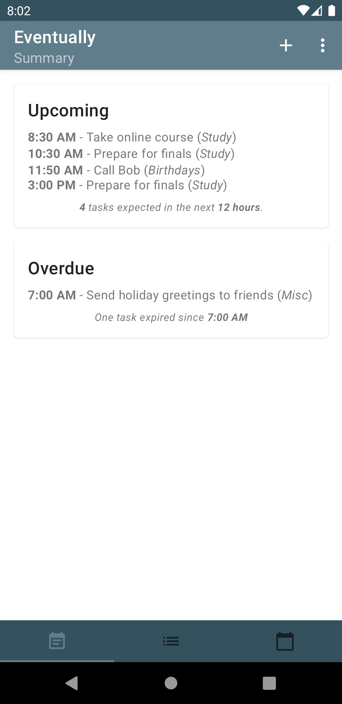
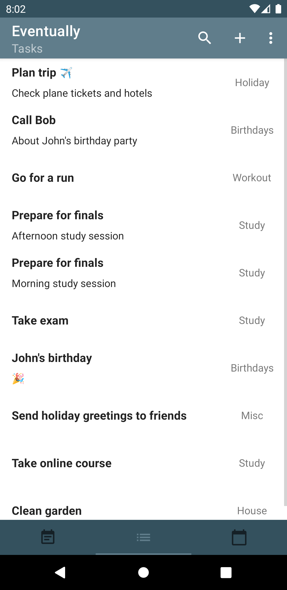
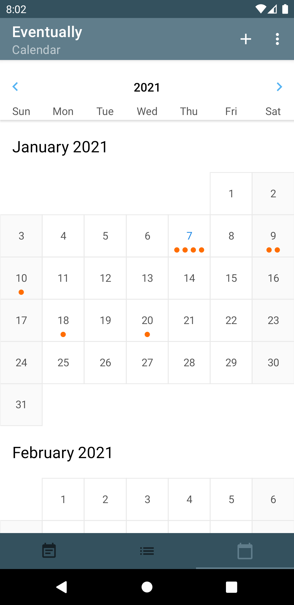
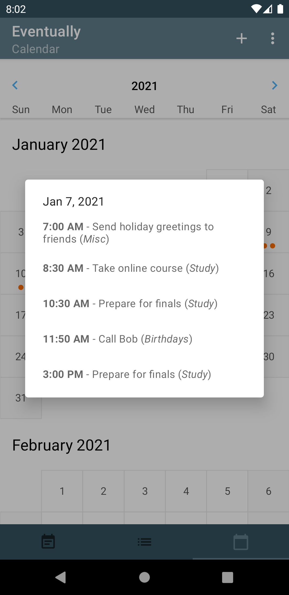
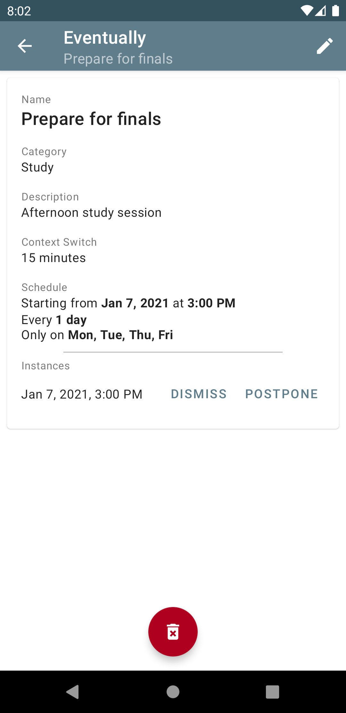
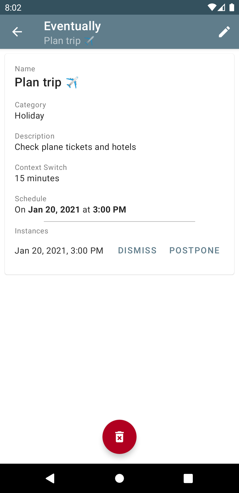

# eventually

`eventually` is a basic task scheduling and time organization app.

  

  

## Features

* **Schedule Summary** - Shows you which tasks are due soon (*upcoming*) and which should have
 already been done (*overdue*).
* **Events Calendar** - Shows you what is happening on each day.
* **Notifications** - The app will let you know when it's time to start thinking about the next
 task (*context switch*) and when it's time to get it done (*alarm*).
* **Privacy & Security** - No user or device data is ever collected or sent anywhere; the app
 will never attempt to open a network connection or ask you for any additional permissions.
* **Ad-free** - The app is free; there are no ads or in-app purchases.

## Installation

APKs for each release can be found in [releases](https://github.com/sndnv/eventually/releases).

## Development

This project is an [Android](https://www.android.com/) application written in [Kotlin](https://kotlinlang.org/).
To make things easier, [AndroidStudio](https://developer.android.com/studio) can be used for development and
testing but it is not strictly necessary.

###### Downloads / Installation:
* [AndroidStudio](https://developer.android.com/studio)

### Getting Started

1) Clone or fork the repo
2) Run `./gradlew qa`

## Contributing

Contributions are always welcome!

Refer to the [CONTRIBUTING.md](CONTRIBUTING.md) file for more details.

## Versioning
We use [SemVer](http://semver.org/) for versioning.

## License
This project is licensed under the Apache License, Version 2.0 - see the [LICENSE](LICENSE) file for details

> Copyright 2020 https://github.com/sndnv
>
> Licensed under the Apache License, Version 2.0 (the "License");
> you may not use this file except in compliance with the License.
> You may obtain a copy of the License at
>
> http://www.apache.org/licenses/LICENSE-2.0
>
> Unless required by applicable law or agreed to in writing, software
> distributed under the License is distributed on an "AS IS" BASIS,
> WITHOUT WARRANTIES OR CONDITIONS OF ANY KIND, either express or implied.
> See the License for the specific language governing permissions and
> limitations under the License.
